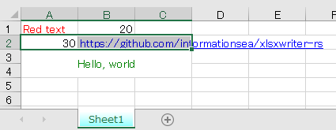

xlsxwriter-rs
=============
[](https://github.com/informationsea/xlsxwriter-rs/actions)


[](https://crates.io/crates/xlsxwriter)
[](https://docs.rs/xlsxwriter)

Rust binding of [libxlsxwriter](https://github.com/jmcnamara/libxlsxwriter)

Supported Features
------------------

* 100% compatible Excel XLSX files.
* Full Excel formatting.
* Merged cells.
* Autofilters.
* Data validation and drop down lists.
* Worksheet PNG/JPEG images.

Coming soon

* Charts.

Feature Flags
-------------

* `no-md5`: Disable image de-duplication and remove md5 function. (See [upstream document](https://github.com/jmcnamara/libxlsxwriter/blob/dcf8d418dba726d2ee123fb111a3174e67b15f6b/docs/src/getting_started.dox#L639) to learn more).
* `use-openssl-md5`: Use OpenSSL implementation of md5 function. (See [upstream document](https://github.com/jmcnamara/libxlsxwriter/blob/dcf8d418dba726d2ee123fb111a3174e67b15f6b/docs/src/getting_started.dox#L629) to learn more).
* `system-zlib`: Use system zlib instead of included zlib.

Build requirements
------------------

* LLVM and clang

### How to build on windows

1. Install Visual Studio
2. Install [LLVM](https://llvm.org/)
3. Set environment variable `LIBCLANG_PATH` as `C:\Program Files\LLVM\bin`
4. Run build

Example
-------



```rust
let workbook = Workbook::new("target/simple1.xlsx")?;
let format1 = workbook.add_format().set_font_color(FormatColor::Red);

let format2 = workbook
    .add_format()
    .set_font_color(FormatColor::Blue)
    .set_underline(FormatUnderline::Single);

let format3 = workbook
    .add_format()
    .set_font_color(FormatColor::Green)
    .set_align(FormatAlignment::CenterAcross)
    .set_align(FormatAlignment::VerticalCenter);

let mut sheet1 = workbook.add_worksheet(None)?;
sheet1.write_string(0, 0, "Red text", Some(&format1))?;
sheet1.write_number(0, 1, 20., None)?;
sheet1.write_formula_num(1, 0, "=10+B1", None, 30.)?;
sheet1.write_url(
    1,
    1,
    "https://github.com/informationsea/xlsxwriter-rs",
    Some(&format2),
)?;
sheet1.merge_range(2, 0, 3, 2, "Hello, world", Some(&format3))?;

sheet1.set_selection(1, 0, 1, 2);
sheet1.set_tab_color(FormatColor::Cyan);
workbook.close()?;
```

Run Example with Cargo
-------
You can explore this example locally following the steps below:

1. Install LLVM and set LIBCLANG_PATH if you are using windows. (see [bindgen doc](https://rust-lang.github.io/rust-bindgen/requirements.html#clang) for details)
2. clone or fork this repository
3. `git submodule update --init --recursive`
    - The above command downloads the required C library so we can compile
4. `cargo run --example hello_spreadsheet`

You should then see the example in `target/simple1.xlsx`. Enjoy!
